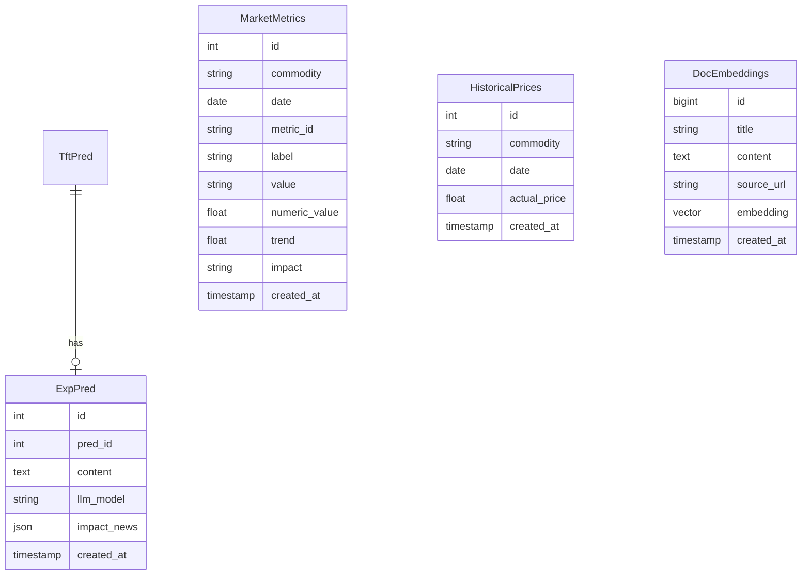

다음은 현재 백엔드 프로젝트가 추가하고 수정해야할 사항들이다.
---

## 1. Market Metrics (시장 지표)

### 🔵 Get Market Metrics

**필요한 API:** 실시간 시장 지표 조회
**정보 출처** DB에서 가져옴

- **URL:** `GET /api/market-metrics`
- **Query Parameters:**

| 파라미터 | 타입 | 필수 | 설명 |
| :--- | :--- | :---: | :--- |
| `commodity` | string | ✅ | 품목명 |
| `date` | string (date) | ❌ | 조회 날짜 (기본값: 오늘) |

- **Response (200 OK) (ex):**

```json
{
  "commodity": "corn",
  "date": "2026-02-03",
  "metrics": [
    {
      "metric_id": "net_long",
      "label": "Net Long (순매수)",
      "value": "15.4K",
      "numeric_value": 15400,
      "trend": 5.2,
      "impact": "High",
    },
    {
      "metric_id": "open_interest",
      "label": "Open Interest",
      "value": "1.2M",
      "numeric_value": 1200000,
      "trend": 1.8,
      "impact": "Medium",
    },
    {
      "metric_id": "wti_crude",
      "label": "WTI Crude Oil",
      "value": "$75.50",
      "numeric_value": 75.50,
      "trend": 3.2,
      "impact": "High",
    },
    
  ]
}
```

**설명:**
- `trend`: 전일 대비 변화율 (%)
- `impact`: 가격에 미치는 영향도 ("High", "Medium", "Low") 

---

## 2. News (뉴스 피드)

### 🔵 Get News Feed
**현재 상태:** ✅ API 연동 완료  
**엔드포인트:** `GET /api/newsdb`

- **Query Parameters:**

| 파라미터 | 타입 | 필수 | 기본값 | 설명 |
| :--- | :--- | :---: | :--- | :--- |
| `skip` | integer | ❌ | 0 | 페이지네이션 offset |
| `limit` | integer | ❌ | 10 | 조회 개수 |

- **Response (200 OK):**

```json
[
  {
    "id": 0,
    "content": "아르헨티나 항만 파업으로 곡물 선적 지연되고 있습니다...",
    "source_url": "https://www.wsj.com/...",
    "created_at": "2026-02-04T06:14:57.801Z"
  }
]
```

**필드 설명:**
- `id`: 뉴스 고유 ID
- `content`: 뉴스 내용
- `source_url`: 원문 링크
- `created_at`: 생성 일시 (ISO 8601)
**수정사항**
- response에 뉴스 title, content 분리

---

## 5. Historical Prices (과거 실제 가격)

### 🔵 Get Historical Actual Prices
**필요한 API:** DB로부터 과거 실제 가격 데이터 조회

- **URL:** `GET /api/historical-prices`
- **Query Parameters:**

| 파라미터 | 타입 | 필수 | 설명 |
| :--- | :--- | :---: | :--- |
| `commodity` | string | ✅ | 품목명 |
| `start_date` | string (date) | ✅ | 조회 시작일 |
| `end_date` | string (date) | ✅ | 조회 종료일 |

- **Response (200 OK):**

```json
{
  "commodity": "corn",
  "prices": [
    {
      "date": "2026-01-15",
      "actual_price": 445.30
    }
  ]
}
```

**설명:**
- 차트의 "과거 실제 가격" 표시에 사용
- 과거 AI 예측과 실제 가격 비교에 사용

---

## 6.  Simulation (시뮬레이션)

### 🟢 POST  Simulation
- **설명** AI 서버에 시뮬레이션을 POST한다. AI서버는 prediction을 response로 주고, 서버는 DB의 원본 예측과 비교한 값을 계산하여 반환한다.
- **URL:** `POST /api/simulate`
- **Request Body:**

```json
{
  "commodity": "corn",
  "base_date": "2026-02-03",
  "feature_overrides": {
    "WTI": 80.0,
    "DXY": 105.5,
    "NET_LONG": 18000,
    "ETHANOL_PROD": 1.15
  }
}
```
- 이때, feature의 종류는 변할 수 있다.

- **Response (200 OK):**

```json
{
  "original_forecast": 452.30,
  "simulated_forecast": 458.75,
  "change": 6.45,
  "change_percent": 1.43,
  "feature_impacts": [
    {
      "feature": "WTI",
      "current_value": 75.50,
      "new_value": 80.0,
      "value_change": 4.5,
      "contribution": 3.6
    }
  ]
}
```

**설명:**
- 서버에서 실제 모델을 사용하여 시뮬레이션 수행
- 더 정확한 예측 결과 제공

---

## 7. High-Impact News Analysis (고영향 뉴스 분석)

### 🔵 Get High-Impact News
**현재 상태:** `explanation` 응답에 포함되어야 함. DB에서 모든 정보를 가져와야함. DB에 넣는 건 AI서버 prediction 시점에 LLM api 쏘고 해당 날짜에 넣기.


```json
{
  "id": 0,
  "pred_id": 0,
  "content": "이 품목은 유가 상승의 영향으로...",
  "created_at": "2026-02-03T13:57:58.415Z",
  "impact_news": [
    {
      "source": "Bloomberg",
      "title": "미 중서부 기습 폭염 경보",
      "impact_score": 92,
      "analysis": "공급망 충격(Supply Shock) 우려..."
    }
  ]
}
```


# 백엔드 API 확장 및 개선 계획

## 1️⃣ 데이터베이스 스키마 확장

### 1.1 MarketMetrics 테이블 추가

[`app/datatable.py`](app/datatable.py)에 새로운 테이블 추가:

- `id`, `commodity`, `date`, `metric_id`, `label`, `value`, `numeric_value`, `trend`, `impact`
- 시장 지표 데이터 저장 (Net Long, Open Interest, WTI Crude 등)

### 1.2 HistoricalPrices 테이블 추가

과거 실제 가격 데이터 저장:

- `id`, `commodity`, `date`, `actual_price`
- 과거 예측 대비 실제 가격 비교용

### 1.3 DocEmbeddings (뉴스) 테이블 수정

- `title` 컬럼 추가 (String 255)
- 기존: `content`만 있음 → 수정: `title`과 `content` 분리

### 1.4 ExpPred 테이블 수정

- `impact_news` 컬럼 추가 (JSON/JSONB 타입)
- 고영향 뉴스 분석 결과를 JSON 배열로 저장
- 구조: `[{"source": str, "title": str, "impact_score": int, "analysis": str}]`



## 2️⃣ Pydantic 스키마 업데이트

[`app/dataschemas.py`](app/dataschemas.py) 수정:

### 2.1 Market Metrics 스키마

- `MarketMetricBase`, `MarketMetricResponse`
- `MarketMetricsResponse` (commodity, date, metrics 배열)

### 2.2 Historical Prices 스키마

- `HistoricalPriceBase`, `HistoricalPricesResponse`

### 2.3 News 스키마 수정

- `NewsBase`에 `title: str` 필드 추가

### 2.4 Explanation 스키마 수정

- `ImpactNews` 스키마 추가 (source, title, impact_score, analysis)
- `ExpPredResponse`에 `impact_news: Optional[List[ImpactNews]]` 추가

### 2.5 Simulation 스키마

- `SimulationRequest` (commodity, base_date, feature_overrides)
- `FeatureImpact`, `SimulationResponse`

## 3️⃣ CRUD 함수 추가

[`app/crud.py`](app/crud.py)에 추가:

### Market Metrics

- `create_market_metric()` - 시장 지표 저장
- `get_market_metrics(commodity, date)` - 특정 날짜의 시장 지표 조회

### Historical Prices

- `create_historical_price()` - 실제 가격 저장
- `get_historical_prices(commodity, start_date, end_date)` - 기간별 실제 가격 조회

## 4️⃣ 라우터 엔드포인트 구현

### 4.1 Market Metrics 라우터 추가

새 파일: `app/routers/market_metrics.py`

- `GET /api/market-metrics?commodity=corn&date=2026-02-03`
- DB에서 해당 품목/날짜의 모든 지표 조회 후 응답 포맷 변환

### 4.2 Historical Prices 라우터 추가

새 파일: `app/routers/historical_prices.py`

- `GET /api/historical-prices?commodity=corn&start_date=...&end_date=...`
- 기간별 실제 가격 데이터 조회

### 4.3 Simulation 라우터 추가

새 파일: `app/routers/simulation.py`

- `POST /api/simulate`
- **현재**: AI 서버 미구현 상태이므로 모의 응답 반환
- **향후**: AI 서버 연동 시 `api_client.py`에 `send_simulation()` 함수 추가
```python
# 모의 응답 예시 (AI 서버 준비 전)
{
  "original_forecast": base_prediction.price_pred,
  "simulated_forecast": base_prediction.price_pred * 1.02,  # 임시 계산
  "change": ...,
  "change_percent": ...,
  "feature_impacts": [...]
}
```


### 4.4 News 라우터 수정

[`app/routers/newsdb.py`](app/routers/newsdb.py) 수정:

- `GET /api/newsdb` 응답에 `title` 필드 포함
- `POST /api/newsdb` 요청에 `title` 필드 추가

### 4.5 Explanation 라우터 수정

[`app/routers/predictions.py`](app/routers/predictions.py):

- `GET /api/explanations/{target_date}` 응답에 `impact_news` 포함
- JSON 컬럼 파싱 처리

## 5️⃣ 메인 앱 라우터 등록

[`main.py`](main.py)에 새 라우터 추가:

```python
from app.routers import predictions, newsdb, market_metrics, historical_prices, simulation

app.include_router(market_metrics.router)
app.include_router(historical_prices.router)
app.include_router(simulation.router)
```

## 6️⃣ AI 클라이언트 확장 (향후)

[`api_client.py`](api_client.py):

- `send_market_metric()` 함수 추가
- `send_historical_price()` 함수 추가
- `send_simulation()` 함수 추가 (AI 서버 준비 시)

---

## 구현 순서

1. **DB 스키마 수정** (datatable.py) - 테이블 정의
2. **Pydantic 스키마** (dataschemas.py) - API 입출력 정의
3. **CRUD 함수** (crud.py) - 데이터베이스 작업
4. **라우터 엔드포인트** - API 구현

   - market_metrics.py (신규)
   - historical_prices.py (신규)
   - simulation.py (신규, 모의 응답)
   - newsdb.py (수정: title 추가)
   - predictions.py (수정: impact_news 추가)

5. **메인 앱 통합** (main.py)
6. **API 클라이언트** (api_client.py) - 외부 서버 연동용

## 주요 고려사항

- **AI 서버 미구현**: Simulation API는 일단 placeholder 로직으로 구현
- **데이터 마이그레이션**: 기존 테이블(DocEmbeddings, ExpPred) 수정 시 마이그레이션 필요
- **JSON 컬럼**: PostgreSQL의 JSONB 타입 사용 (성능 고려)
- **에러 처리**: 각 엔드포인트에 적절한 404, 400 에러 응답 추가